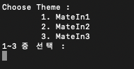

# CLI-Chess 만들기
Java를 이용해 온라인으로 같이 플레이 할 수 있는 Chess 게임        
대전 모드, 퍼즐 모드 두 가지 존재함.      
jar를 Extract하여 cmd창에서 실행 가능함.          

### 구성 파일들      

Board.java : 체커보드 class로 체스판을 2차원 배열로 나타냄.      

Controller.java : 기물 class 입력 좌표 기물 위치로 변경 함수, 기물 움직임 처리 함수를 가짐.           

DDual.java : 상대방과의 대전은 save file로 저장해 온라인으로도 플레이가 가능하게 해주는 class.           

Gamepiece.java : 체스 기물들의 흑백, 기물 형태, 행마법을 가지는 class.          

Main.java : 프로그램 entry point로 프로그램의 첫 진입 class.           

Menu.java : 대전 메뉴와 퍼즐 메뉴 선택을 받고 대전 메뉴에서의 파일 리스트 출력 기능을 가지는 class.      

Puzzle.java : 하나의 퍼즐 Object를 만드는 class로 퍼즐이 가지고 있는 각종 fields를 정의한 class.      

PuzzleControl.java : 하나의 퍼즐 Object를 제작하는 기능을 단계적으로 나타낸 class.      

PuzzleMain.java : 퍼즐 메뉴로, 기존에 있는 퍼즐 파일 리스트 출력 및 퍼즐 제작 기능 선택 가능 class.      

## 1. 메뉴 화면
   로그인할 ID 입력 후, 플레이할 모드를 선택할 수 있음.         
   각 단계마다 여러 커맨드를 입력 가능하며, 같은 커맨드라도 여러 줄임말로 사용가능함.         
        

        

1.1 대전 메뉴        
        

1.2 퍼즐 메뉴        
        

## 2. 대전 모드        
        

두 명이서 대전 할 수 있는 모드임.      
유저 ID를 이용해 플레이했던 게임을 재접속 가능함.     
대전 모드에 접속했던 유저ID가 동일해야지만 플레이 가능함.
저장된 파일을 서로 공유하여 온라인으로 플레이가 가능하게 구현됨.                 
좌표 입력을 통해 기물들을 움직일 수 있음.       
    
    좌표 입력 :  a2 a4 // a2의 기물을 a4로 움직임

이외 커맨드로는  Back, Exit, Next 존재함.     

        

P1와 P2의 대전 모드 실행화면        

## 3. 퍼즐 모드        
직접 체스 퍼즐을 제작해 플레이할 수 있는 모드임.      
제작 or 기존 퍼즐을 플레이 할 수 있음.      

###  3.1 퍼즐 제작 모드     
- 테마 선택     
      

1~3 숫자를 이용한 테마 선택으로 몇 수 안에 체크메이트를 만들지 결정하는 단계임.       
만약 MateIn1이면 흑백 각각 1턴 안에 게임이 끝나는 퍼즐을 말함.        

- 기물 배치     
       

기물을 배치하여 퍼즐 형태를 만드는 단계         
커맨드

    기물 선택 형식 : <비개행공백열0><기물지정자>
    기물 배치 형식 : <비개행공백열0><좌표입력>
    이니셜 R    P    B      Q     K    N
    풀네임 Rook Pawn Bishop Queen King Knignt
    한글   룩   폰    비숍    퀸     킹   나이트
    White
    Black
    Help
    Back
    Exit
    Next

- 정답 움직임 설정      
         

좌표입력을 통해 퍼즐 정답 움직임을 입력함.        
주어지는 턴 수는 테마 단계에 따라 나뉨.                

- 퍼즐 이름 설정        
          

퍼즐의 이름을 입력해줌.           

### 3.2 퍼즐 플레이          
           

좌표 입력을 통해 퍼즐을 해결함.         
커맨드      
replay, hint, solution, next, previous, exit